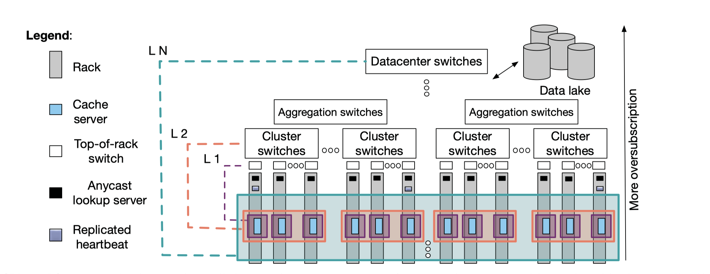

<h1>D4N-S3Select-Caching
</h1>

** **

- [1. Vision and Goals Of The Project](#1-vision-and-goals-of-the-project)
- [2. Users/Personas Of The Project](#2-users-personas-of-the-project)
- [3. Scope and Features Of The Project](#3-scope-and-features-of-the-project)
- [4. Solution Concept](#4-solution-concept)
- [5. Acceptance criteria](#5-acceptance-criteria)
- [6. Release Planning](#6-release-planning)

## 1.   Vision and Goals Of The Project

D4N is a multi-layer cooperative caching solution which aims to improve performance in distributed systems by implementing a smart caching algorithm, which caches data on the access side of each layer hierarchical network topology, adaptively adjusting cache sizes of each layer based on observed workload patterns and network congestion.

The goal of this project is to enhance D4N to directly support S3 Select, a new S3 feature that allows applications to select, transform, and summarize data within S3 objects using SQL query commands. This will allow the clients to read and cache only a subset of object, stored in the Ceph cluster, rather than retrieving the entire object over the network, eventually reducing the traffic of data over the network.

## 2. Users/Personas Of The Project

The only users in the D4N architecture are the Clients, which are the Spark jobs running on the server racks. The Spark jobs read and write data from the Ceph storage clusters.

The D4N Caching architecture is a caching middleware between the Clients and Ceph storage. 
<!-- The Rados Gatway(RGW) is the object storage interface of Ceph and it is responsible for the communication between the clients and  ceph.  -->

## 3.   Scope and Features Of The Project

1. Create client workloads that generate S3 Select request traffic, and can measure throughput and latency of same.
2. Design and implement a prototype S3 select cache strategy or strategies within D4N; S3 Select to read subset of object from Ceph.
3. Cache data and update the global directory, return formatted response in Arrow. Hence, evaluating the result of the S3 Select cache
4. Update the Spark jobs to read the response in arrow format.

## 4. Solution Concept
<!-- Some technical descp about D4N -->
### D4N Caching:

<i>Figure 1: Architecture of D4N </i>

This project is focused around D4N. D4N is a datacenter-scale data delivery network. D4N's main goal is to reduce the network congestion and increase the throughput of fetching data from Data Lakes by using a cooperative caching on the access side of the network link. D4N is implemented on top of Ceph object storage system by modifying RGW service (Rados Gateway). RGW acts as an interface between S3 and Swift protocols, and the backend Object store of the Ceph cluster. Clients directs all the data requests to RGW using S3 or Swift protocol. If the cache does not contain the requested data, the request is directed to the backend storage system. Now the retrieved data is stored locally on the rack, and next request for the same data will be serviced quickly. D4N implements caching using three components:
1. Cache servers - Client requests are directed to them for servicing
2. Lookup service - Clients use this to find their nearest cache
3. Heartbeat service - Lookup service uses this to keep track of all the active caches

<i>Figure 2: The system architecture after adding the deliverables of this project</i>

Here we briefly describe all other technologies used in the project:

1. <b>Ceph</b> - Ceph is a distributed storage platform implemented as an object storage. It is highly scalable and distributed system running on a compute cluster. It stripes and distributes the file across multiple nodes for high throughput and fault-tolerance. It supports Object, Block, and File System storage by providing different layers over object storage, and a single interface to all the three storage types. It supports these functionalities using various daemons (cluster monitors, object storage devices, http gateways, etc.) running on top of each node.

2. <b> RGW </b> - RGW is a Ceph component that provides object storage functionality with an interface that is compatible with S3 Restful API. 

3. <b>S3</b> - S3 is a protocol that is used to store and retrieve any amount of data, on the web. Here S3 is being used to access the Ceph storage clusters using boto3 library.

4. <b>S3 Select</b> - S3 Select is a service that allows running simple queries on top of S3 Objects. This allows users to retrieve selective data from objects, as per the specified query, rather than fetching the entire object, thus saving network bandwith, processing time and resources. S3 Select also enables for higher level analytic-applications such as SPARK-SQL, using the "selection of a restricted subset" feature to improve their latency and throughput

In the current implementation of D4N, the client reads and caches the entire files from the storage although a subset of the object might be required.  With S3 Select, the goal is to enable the clients to retrieve and cache the data in D4N,resulting in reduced network data transfer, and efficient use of cache memory. 

5. <b>Apache Arrow</b> - Apache Arrow is a software development platform for building high performance applications that process and transport large data sets. It is designed to both improve the performance of analytical algorithms and the efficiency of moving data from one system or programming language to another. We aim to use Arrow as the format for communication from the cache to the clients, to make the transfer of cached data more efficient.

7. <b>Global directory (REDIS)</b> - 
Redis is an open source (BSD licensed), in-memory data structure store, used as a database, cache, and message broker. In contect of D4N, Redis is being used a Global directory to index that data stored in the distributed cache.
<!-- 6. Read Cache -->
8. <b>Compute Nodes/Clients</b> - The compute nodes are the spark jobs that run on the cluster. They are the users of the D4N caching mechanism and they request data from the Ceph storage. However, they do not directly communicate with the Ceph storage, they do that through the Rados gatway(RGW). Part of this project, also focuses on enhancing the clients to accept the results of S3 select, from the cache, in Arrow format.

<i>Figure 3: Spark Architecture</i>

9. <b> Spark </b> -  Apache Spark is an open-source, distributed processing system for big data workload. Spark utilizes in-memory caching, and optimized query execution for fast analytic queries against data of any size. Spark will enable code resuage across multiple workloads—batch processing and interactive queries.
Part of this project involves modifying Spark's System to request S3 Select queries where S3 Select allows applications to retrieve only a subset of data from an object.  

To accomplish our overall goal, we will break it into these subtasks:
1. Modify Spark to make it request S3 Select queries - Apache jobs(a) are inturn modified to place query requests of S3 Select to the remote Ceph cluster. This also offers better resource utilisation of Spark jobs and significant improvement in perfomance.

2. Make Spark request and understand the Arrow file format - Queried results from computation would be returned from D4N Cache or the Remote Ceph Storage Cluster, in Arrow format(b) for efficient shipment of columnar data. In current implementation, Spark jobs support CSV format of data. 

3. Add Cient-side implementation for Arrow in order to parse results from S3 Select engine in Arrow format - Add functionality in S3 Select to return result of CSV queried files in Arrow format.

4. Combine S3 Select with D4N - D4N(c) to be merged with S3 to have S3 compatible object storage. S3 API extended with Select queries is now understood by the D4N. 

5. Cache the results in D4N from remote Ceph cluster - Queried results(d) from the Remote Ceph Storage Cluster is returned to Spark jobs and cached in the 2 layer cache in D4N for future use. 

6. Lookup in the cache before forwarding the request to the remote Ceph cluster - The S3 Select requests by Spark jobs for retreiving objects would be first checked in D4N (in the second layer, as contents from all cache servers would be pooled here) before requesting the Remote Ceph Storage Cluster. The presence of D4N helps accelerate workloads with strong locality and limited network connectivity between compute clusters and data storage.

7. Retrieve the data found in D4N or generate a request to the remote Ceph - The subset of object queried if found, is returned in Arrow format from the Object storage cache. If not, a new request(e) is placed to the Remote Ceph storage cluster via the object interface, RGW(RADOS Gateway).  

## 5. Acceptance criteria

1. <b>Part A </b> - We aim to complete the implementation of S3 Select in the D4N caching cluster, which is minimum acceptance criteria for the project. The product which satisfies the minumum acceptance criteria will support the following operations -

1. Merge S3Select pipeline into the Rados gateway (part of D4N).
2. Make sure that the Rados gateway can accept S3 Select requests and process it using newly merged S3Select pipeline.
3. Test D4N for the following :
   1. Can a S3 Select request to D4N generate a backend Ceph request to fetch the uncached object? 
   2. Can D4N cache this recently fetched object through the S3 Select pipeline?
   3. Can D4N run the S3 Select query on top of an object that was recently brought in?
   4. Can D4N send the S3 Select query results back to the client?
   5. Can D4N run S3 Select query on cached objects? The object could have been cached as an outcome of a previous S3 or S3 Select request.

## Optional:
If time permits, test the latency of an S3 Select request on a cached and an uncached object, and report the results.

2. <b>Part B </b>- We plan to accommodate S3 Select to return the result of queried CSV in an Arrow format. 

To test, 

1. Run a simple S3 Select query on a CSV. 
2. The result must be stored in an .arrow file. 
3. Since Arrow is an in-memory format, use a reader to read and display the Arrow result. 

## 6.  Project Timeline

Detailed user stories, plan and backlog will be via Tiaga 

Weeks (2/12 - 2/26) 
1. Build and run master Ceph,
2. Understand RGW Codebase
3. Investigate Arrow and Spark Integration
5. Begin to build Spark with S3 Select

Weeks (2/27 - 3/12)
1. D4N and S3 Select codewalk; understand workflow for S3 Select on Spark and Arrow with Ceph.
2. Connect D4N and redis
3. Setup backend Ceph
4. Run batch jobs and python test scripts

Weeks (3/13 - 3/26)
1. Setup spark jobs using Spark-Select
2. Test S3 Select with D4N
3. Test S3 Select with Backend Ceph
4. Debug D4N S3 Select with Cached objects

Weeks  (3/30 - 4/13)
1. Setup Docker images for S3 Select Standalone branch
2. Run tests on containerized S3 Select
3. Debug D4N (1/2) S3 Select with Uncached objects
4. Study ARROW IPC, IO and Flight RPC formats
5. Convert .csv to .arrow format using Arrow CPP Libraries

Final Weeks (4/14 - 4/26)
1.  Create readers to visually analyse arrow and parquet files
2.  Parse S3 Select projections based on data types
3.  Parse S3 Select query results to Arrow by integrating Arrow format in S3 Select Library
4.  Debug D4N (2/2), Inspect packet exchanges between different clusters with TCPDUMP
5.  Test S3 Select with both Cached and Uncached objects 

** **

